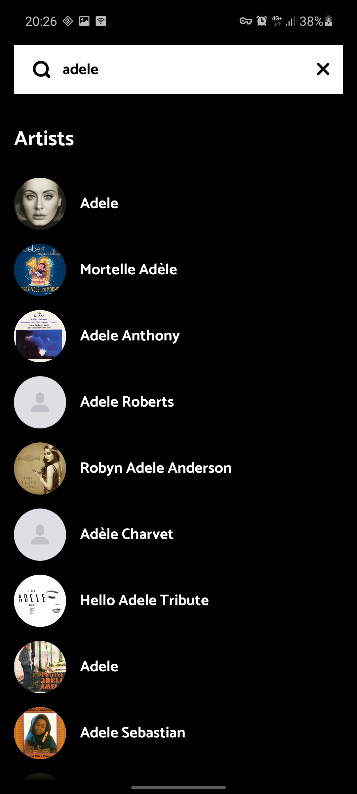
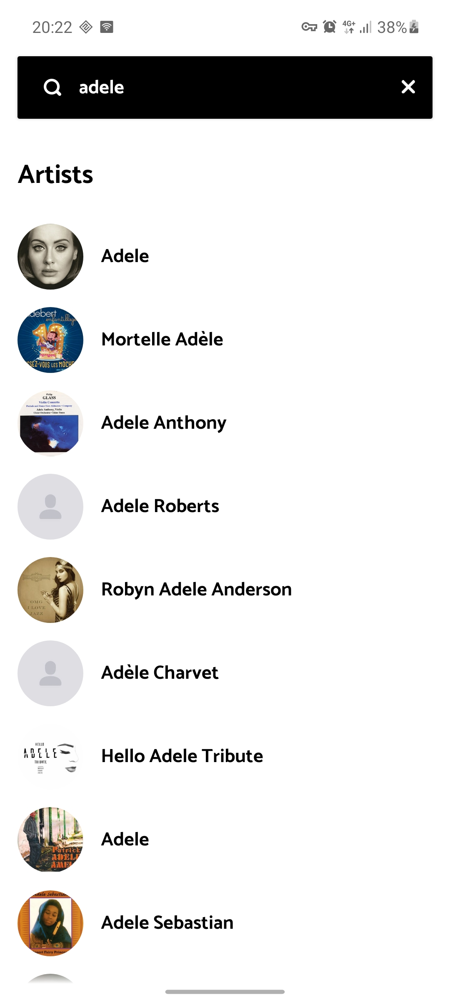
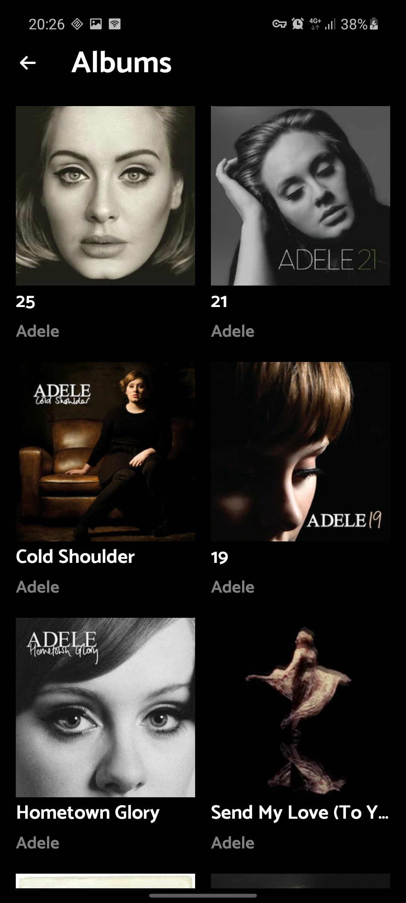
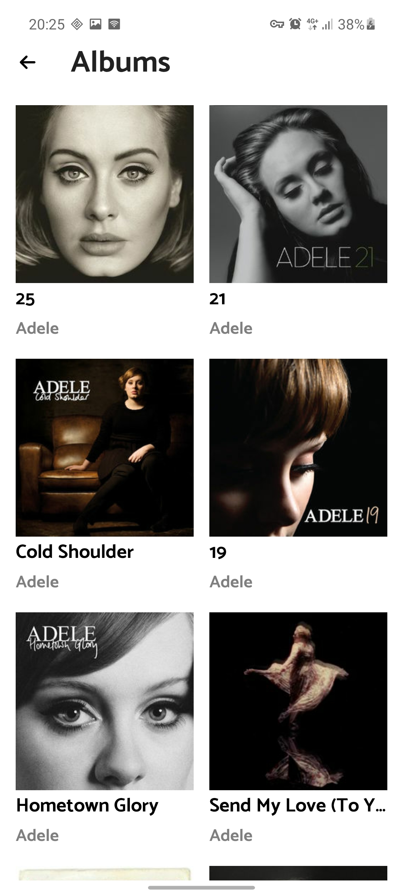
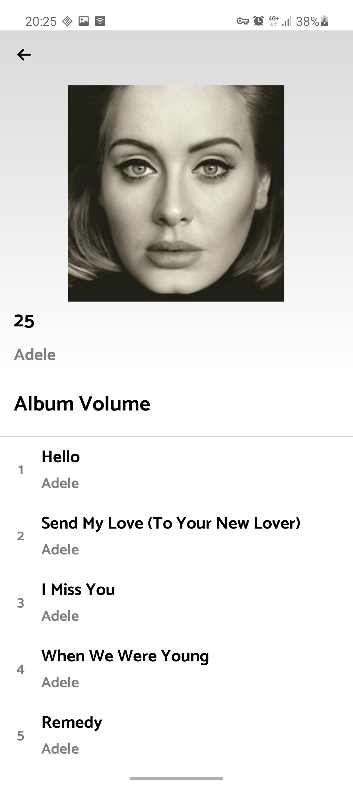

# kotlin-deezer
<h3>A kotlin project with Deezer as rest api provider</h3>

developed using <strong>Coroutines</strong>, <strong>Hilt</strong>, <strong>Paging 3</strong>, <strong>Retrofit</strong> & <strong>Navigation ui</strong>

Project Features:

1. Search for artists

 

2. List albums of an artist

 

3. List tracks of an album

 
